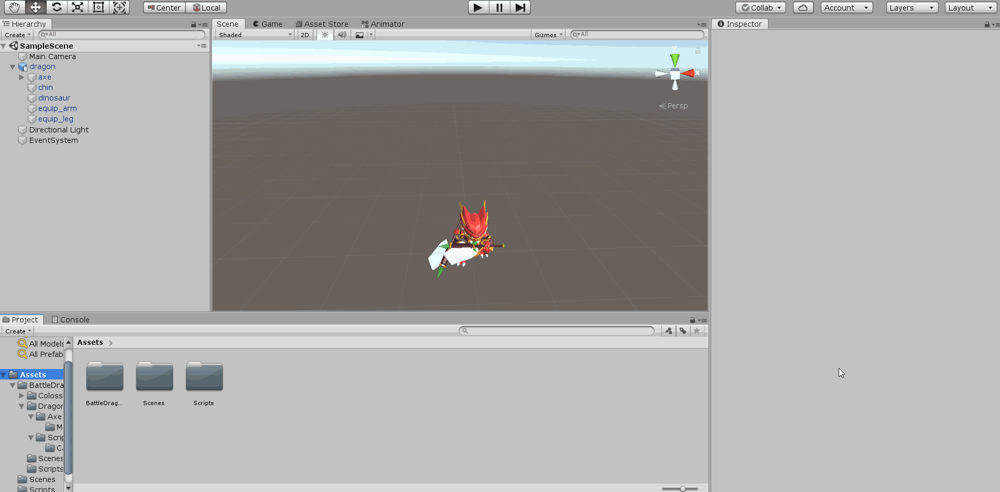
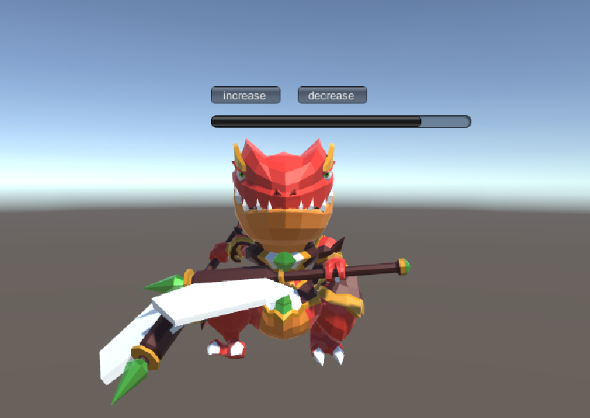
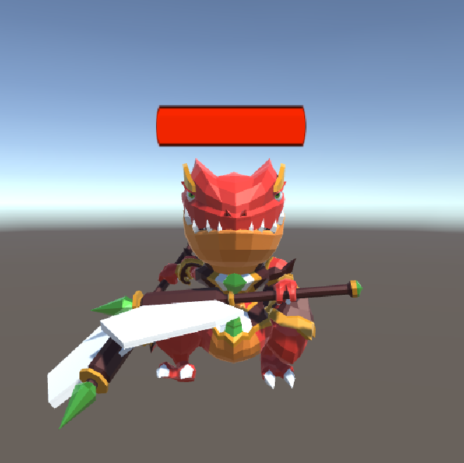

# 3D游戏编程 HW9

- [血条(Health Bar)设计](#blood)

- [IMGUI](#IMGUI)

    - [演示效果](#imguirun)

- [UGUI](#ugui)

    - [演示效果](#uguirun)

- [两者比较](#compare)

- [预制的使用方法](#prefab)  

</br></br>

<h2 id="blood">血条(Health Bar)设计</h2>

<h3 id="IMGUI">IMGUI</h3>

这种实现比较容易, 直接在脚本里面添加相关的GUI即可.  
```c#
using System.Collections;
using System.Collections.Generic;
using UnityEngine;

public class IMGUI : MonoBehaviour {
    public float health;
    private float change_health;
    private Rect blood_rec;
    private Rect blood_inc;
    private Rect blood_dec;

    private int blood_rec_x;
    private int blood_rec_y;
    private int blood_rec_len;
    private int blood_rec_height;
    private float blood_unit;

    void Start() {
        health = 0;
        change_health = 0;
        blood_unit = 0.2f;
        blood_rec_x = 700;
        blood_rec_y = 270;
        blood_rec_len = 300;
        blood_rec_height = 30;

        blood_rec = new Rect(blood_rec_x, blood_rec_y, blood_rec_len, blood_rec_height);
        blood_inc = new Rect(blood_rec_x, blood_rec_y - 33, 80, 20);
        blood_dec = new Rect(blood_rec_x + 100, blood_rec_y - 33, 80, 20);
    }

    void OnGUI() {
        if (GUI.Button(blood_inc, "increase")) {
            change_health = change_health + blood_unit > 1.0f ? 1.0f : change_health + blood_unit;
        }
        if (GUI.Button(blood_dec, "decrease")) {
            change_health = change_health - blood_unit < 0.0f ? 0.0f : change_health - blood_unit;
        }
        health = Mathf.Lerp(health, change_health, 0.05f);
        GUI.HorizontalScrollbar(blood_rec, 0.0f, health, 0.0f, 1.0f);
    }

    private void Update() {
        
    }
}
```

<h3 id="imguirun">演示效果</h3>

| gif动图| 静态图片|
|:-:|:-:|
| | |  

<h3 id="ugui">UGUI</h3>

我们为上图的小恐龙添加一个血条.  
- 添加UI -> Canvas
- Canvas，添加Slider
- 删除Handle Slider Area
- 删除Background
- 修改颜色
- 设置maxValue  

<h3 id="uguirun">演示效果</h3>

  

<h3 id="compare">两者比较</h3>

IMGUI的文档如下: `Unity originally had just two GUI Components. These have since been replaced by both the modern UI System, and the scripting-driven IMGUI System. The original GUI components are kept for legacy purposes but should not be used for new projects`  
IMGUI的特点是性能比较低, 主要用于游戏调试与自定义的Inspector面板.  
而UGUI的运行效率会比IMGUI强, 性能比较好, 但是缺点是功能不是很完善, 目前主要用于游戏中的交互.  

<h3 id="prefab">预制的使用方法</h3>

- 将预制拖入scene中.
- 导入相应的资源, 构建自己需要的场景.
- 然后将Canvas prefab拖到物体上, 变为子对象.
- 最后修改相应的属性.  


